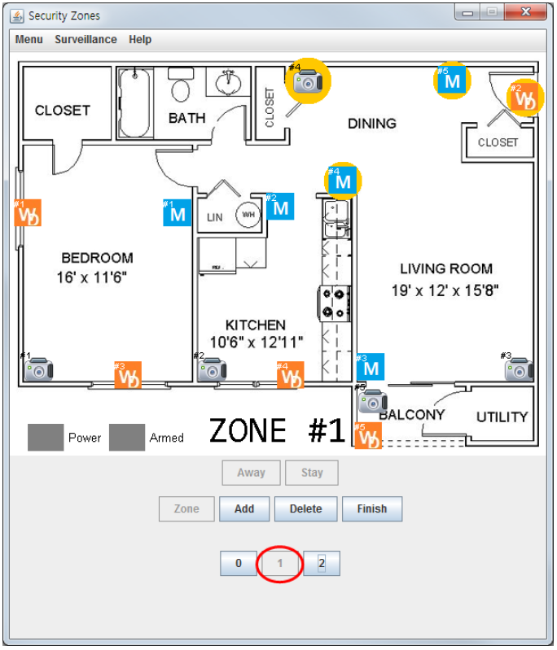

# CS350-SafeHome
CS350 Intro. to SW Enginnering. SafeHome, the surveillance system for house keeping.

## Final Deliverables

You can open the entire java project using Eclipse.

[Source Code](https://github.com/SuminHan/CS350-SafeHome/tree/master/safehome%20source%20code%20%2B%20javadoc/safehome)

You can also see javadoc in the safehome directory (safehome/doc/index.html)

[End user manual](EndUserManual.pdf)

[Software Requirement Specification + Analysis + Design Model](SRSAnalysisDesignModel-20150607.pdf)

[SafeHome Final Report](SafeHomeFinalReport20150607.pdf)
