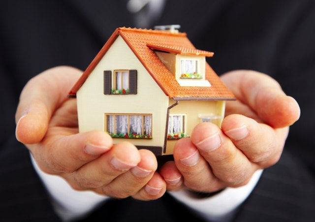
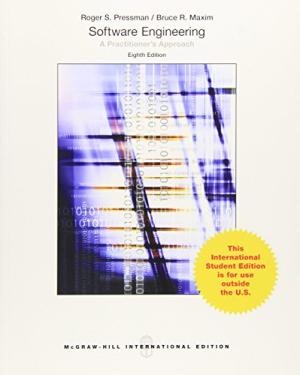

# CS350-SafeHome
CS350 Intro. to SW Enginnering. SafeHome, the surveillance system for house keeping.

This project is based on the SafeHome system in the textbook:

[software engineering a practitioner's approach 8th international edition](https://www.abebooks.com/servlet/BookDetailsPL?bi=15906308924&searchurl=sortby%3D17%26an%3Droger%2Bs%2Bpressman%2Bbruce%2Br%2Bmaxim)

## Final Deliverables

You can open the entire java project using Eclipse.

[Source Code](https://github.com/SuminHan/CS350-SafeHome/tree/master/safehome%20source%20code%20%2B%20javadoc/safehome)

You can also see javadoc in the safehome directory (safehome/doc/index.html)

* [End user manual](EndUserManual.pdf)

* [Software Requirement Specification + Analysis + Design Model](SRSAnalysisDesignModel-20150607.pdf)

* [SafeHome Final Report](SafeHomeFinalReport20150607.pdf)
